# Игра с графическим интерфейсом "Подземелье"

Игрок играет за персонажа, его цель – преодоление уровней различной сложности, на которых находятся монстры, управляемые компьютером.
Уничтожая монстров, игрок получает очки опыта, которые можно вложить в характеристики персонажа.

## Технологии разработки

Игра разработана на языке C# с использованием Windows Forms.

## Запуск

Для запуска игры используется исполняемый файл `Dungeon.exe`.

Лучше поместить исполняемый файл в отдельную папку, так как игра создаёт свои файлы для сохранений рядом с исполняемым файлом.

## Описание игры

При запуске игры открывается форма авторизации пользователя, на которой есть поля для ввода логина и пароля.

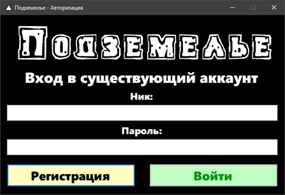

Пользователь может сменить форму авторизации на форму регистрации.
В случае авторизации, после ввода логина и пароля, данные сверяются с данными из файла.
В случае успешной проверки выводится соответствующее сообщение, форма авторизации скрывается, открывается главная форма, начинается загрузка.
В случае регистрации пользователя, программа проверяет, не существует ли пользователя с введённым логином в системе.
Если пользователь с таким логином уже существует – выводится соответствующее сообщение, если такого пользователя нет – проходит добавление данных в файл, пользователю выводится сообщение об успешной регистрации, форма регистрации скрывается, открывается главная форма, начинается загрузка.

После загрузки всех необходимых данных, приложение будет ожидать от пользователя нажатия любой клавиши.
После нажатия открывается главное меню.
Здесь, пользователь может перейти к старту игры, посмотреть правила, посмотреть рекорды, изменить настройки или выйти из игры.

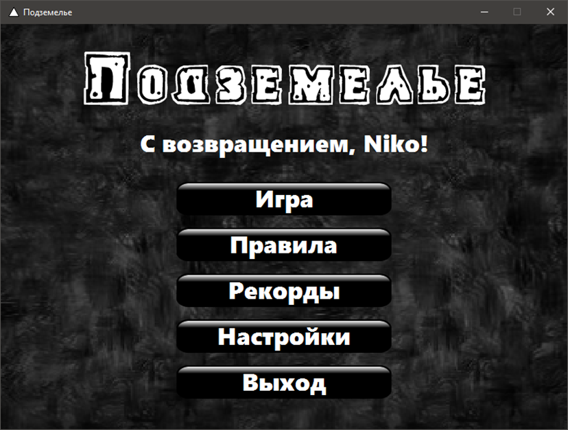

В случае выбора старта игры, пользователь может либо начать новую игру, либо загрузить одно из своих сохранений.
При создании новой игры, пользователь выбирает уровень сложности, персонажа и ключ генерации мира, после чего начинается загрузка игры.

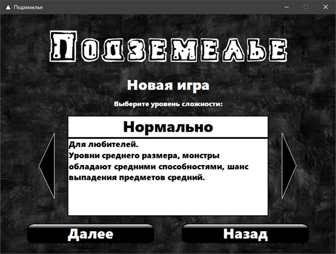

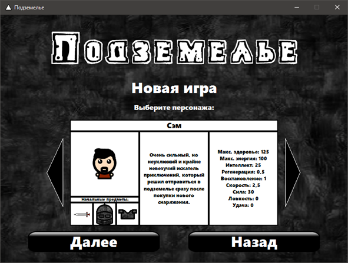

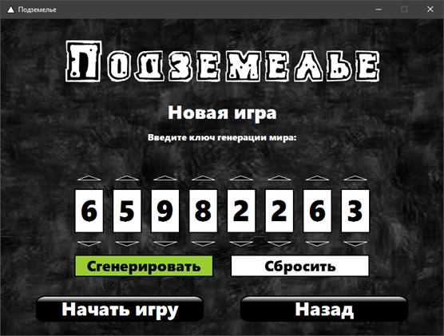

Во время игры пользователь может открыть игровое меню клавишей ESC или клавишей, назначенной в настройках управления.
В игровом меню можно сохранить процесс, загрузить сохранение, посмотреть правила, изменить настройки, или выйти в меню.

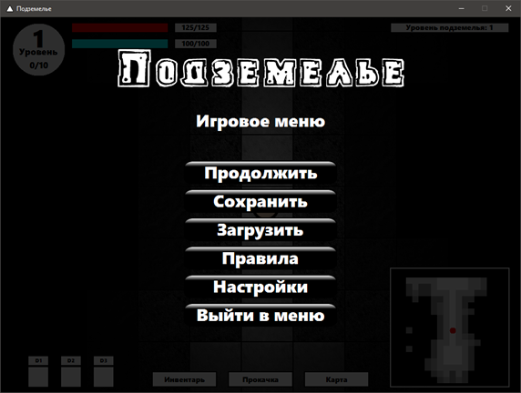

В случае, если выбранная сложность – хардкор, при попытке сохранить игру появится сообщение об ошибке.

Пользователь может передвигать персонажа, взаимодействовать с различными предметами, а также наносить удары.
Монстры, будут пытаться убить героя, управляемого игроком.

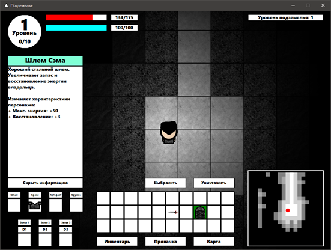

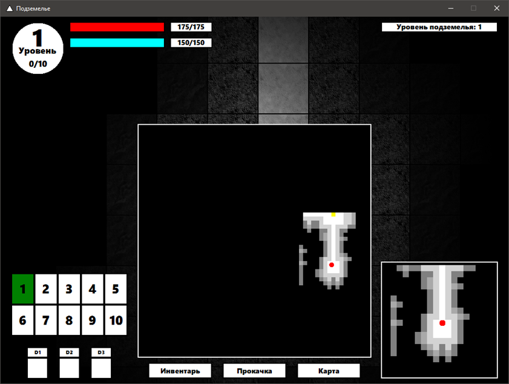

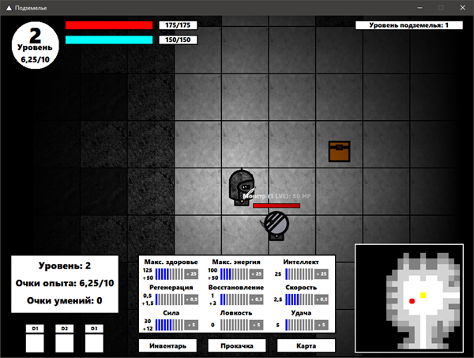

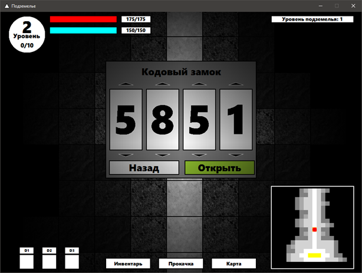

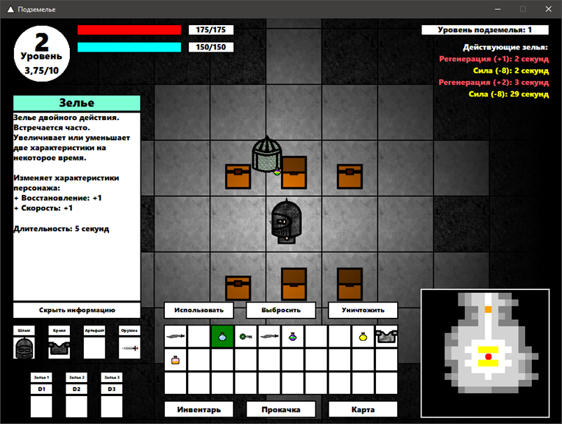

В случае, если герой умирает, игра заканчивается поражением.
Чтобы победить в игре, необходимо пройти 10 уровней и, убив последнего босса, подобрать выпавший с него особый артефакт, после чего игра заканчивается победой.

Пользователь может посмотреть рекорды, выбрав соответствующий пункт меню.
В открывшейся форме можно посмотреть как личные рекорды, так и все рекорды, поставленные пользователями.

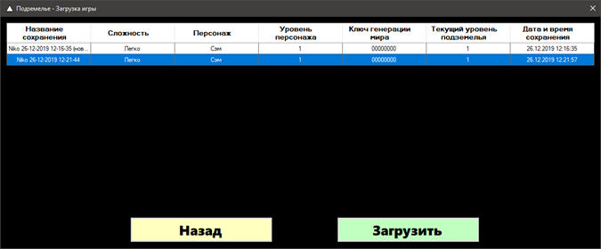

После выхода из игры снова будет показана форма авторизации.
В случае закрытия формы авторизации, приложение завершает свою работу.

## Полный функционал игры

Программа обеспечивает:

1. Регистрацию новых пользователей;
2. Авторизацию пользователей;
3. Отображение главного меню, в котором есть кнопки для начала игры, просмотра правил, просмотра рекордов, изменения настроек и выхода из игры;
4. Возможность посмотреть правила игры;
5. Возможность изменения настроек разрешения экрана;
6. Создание новой игры - пользователь выбирает уровень сложности («Легко», «Нормально», «Сложно» и «Хардкор»), игрового персонажа и вводит ключ генерации мира (или генерирует случайный);
7. Генерацию и графическое отображение уровня.
   Каждый уровень генерируется случайным образом по ключу генерации мира.
   Уровень содержит комнаты, некоторые из которых могут быть заблокированы дверьми, а также коридоры;
   На уровне встречаются монстры и сундуки с предметами;
   Монстры могут обладать бронёй, оружием, а иногда и артефактами, как и игрок;
   Над монстрами виден их уровень и количество здоровья.
   У каждого монстра есть его статус («Монстр», «Хранитель ключа», «Босс уровня» и др.), который также отображается над монстром;
8. Управление игровым персонажем согласно установленным клавишам в настройках управления;
9. Возможность открытия игрового меню, в котором расположены кнопки для: сохранения игры, загрузки сохранения, просмотра правил, изменения настроек и выхода в главное меню;
10. Сохранение и загрузку игры.
    Сохранений может быть несколько.
    У каждого пользователя свои сохранения;
    У каждого сохранения есть название, а также небольшая сводка информации о сохранённой игре, которое пользователь может написать самостоятельно при сохранении;
    При автосохранении название для сохранения указывается автоматически;
11. Возможность изменения настроек аудио
12. Возможность изменения настроек интерфейса
13. Возможность изменения настроек управления
14. Графическое отображение окна инвентаря персонажа.
    При открытии инвентаря игра не останавливается;
    Инвентарь должен иметь 3 строки по 10 ячеек.
    Также должны быть доступны специальные ячейки для: шлема, брони, артефакта, меча и трёх зелий.
    Предметы в инвентаре можно перемещать по ячейкам, а также надевать на персонажа.
    При открытом инвентаре, должны быть видны кнопки для использования, выброса и уничтожения предмета (если с предметом данное действие возможно).
    Если выбросить предмет, он будет виден на земле.
    Его можно вновь подобрать – для этого нужно подойти и нажать назначенную в настройках клавишу клавиатуры;
15. Графическое отображение окна прокачки персонажа;
16. Графическое отображение окна карты персонажа;
    На карте обозначены места, где игрок уже был, а где – ещё не был;
17. Убийство монстров.
    При убийстве монстра игрок получает очки опыта в соответствии с уровнем монстра, количество получаемого опыта также зависит от интеллекта персонажа;
    При убийстве монстра есть небольшой шанс выбить его экипировку (тоже зависит от удачи персонажа).
    При этом ключи от дверей падают с монстров, которые их хранят, с вероятностью 100%;
18. Генерацию двух специальных комнат - одна закрыта кодовым замком и содержит несколько сундуков с хорошими предметами – бонусная комната, вторая – комната босса, в которой есть дверь, ведущая на следующий уровень;
19. Функционал предмета "Ключ". Ключи от дверей можно получить при убийстве монстра, который его хранит.
    Ключ от двери на следующий уровень всегда находится у босса уровня.
    Ключи невозможно уничтожить, ключ расходуется (исчезает из инвентаря) при открытии нужной двери.
    Ключи подходят к дверям только на том же уровне, где были найдены;
20. Функционал предмета "Записка".
    Записки – уникальные для каждого уровня предметы, содержащие подсказки к кодовому замку от двери, ведущей в бонусную комнату на уровне.
    Записки невозможно уничтожить вручную – они будут удалены только после открытия бонусной комнаты;
21. Функционал предмета "Зелье".
    Зелья – предметы инвентаря, которые можно использовать только один раз, после чего они исчезают.
    Зелья могут улучшить некоторые характеристики персонажа на некоторое время.
    При использовании появляется таймер, показывающий, когда закончится время действия зелья.
    Использовать зелье можно как через инвентарь, так и через ячейки быстрого доступа, каждой из которой соответствует назначенная в настройках клавиша;
22. Возможность прокачать персонажа.
    Игрок имеет уровень, очки опыта и очки умений.
    Для повышения уровня необходимо накопить определённое количество очков опыта.
    С повышением уровня игрок получает очки умений (количество зависит от удачи), которые можно использовать для улучшения характеристик персонажа;
    Для открытия окна прокачки персонажа, необходимо нажать назначенную в настройках клавишу или открыть через инвентарь.
    В окне прокачки можно вложить очки умений в одну из девяти характеристик, после чего значение выбранной характеристики будет увеличено;
23. Функционал сундуков.
    Сундуки – могут находиться в комнатах подземелья.
    В сундуках можно найти различные предметы (кроме ключей).
    Шанс найти хороший предмет зависит от удачи персонажа.
    При открытии сундука, его содержимое располагается рядом;
24. Работу искусственного интеллекта монстров.
    Монстры передвигаются по подземелью, а при виде игрока – нападают на него.
    Монстр может следовать за игроком, однако если монстр хранит ключ, то он не покинет «свою» комнату.
25. Перерождение монстров на уровне.
    Монстры на уровне перерождаются до тех пор, пока босс уровня жив.
    Монстры перерождаются не сразу после смерти, а через некоторое время;
26. Создание всех 10 уровней, между которыми можно перемещаться.
    Переход на следующий уровень находится в комнате за комнатой босса уровня;
27. Возможность изменения настроек автосохранения;
28. Игроку поражение, если его персонаж умер;
29. Игроку победу, если он подобрал особый артефакт, выпавший с босса 10-го уровня;
30. Запись рекорда по завершению игры (победа или поражение), а также возможность просматривать список всех рекордов пользователя и общий список рекордов всех пользователей.

## Описание логической структуры системы

Программа содержит 32 класса.

Классы форм (5):

- `LauncherForm` – форма авторизации / регистрации пользователей;
- `MainForm` – главная форма, которая отображает меню, саму игру, правила, настройки;
- `SaveForm` – форма сохранения игры;
- `LoadForm` – форма загрузки игры;
- `RecordsForm` – форма, в которой отображаются рекорды;

Основные классы (19):

- `DungeonOwner` – владелец. Необходим для определения владельца контейнера;
- `DungeonLevel` – уровень подземелья. Наследуется от DungeonOwner. Содержит методы для генерации уровня, а также хранит свойства самого уровня подземелья;
- `DungeonObject` – объект подземелья. Наследуется от DungeonOwner. Нельзя создать явно – только через наследников;
- `DungeonCreature` – существо. Наследуется от `DungeonObject`. Нельзя создать явно – только через наследников;
- `DungeonHero` – герой. Наследуется от `DungeonCreature`. Предполагается, что на уровне может находиться только один герой, управляемый игроком, остальные существа – монстры. В случае смерти героя игроку засчитывается проигрыш;
- `DungeonMonster` – монстр. Может быть обычным или боссом. Наследуется от `DungeonCreature`. Имеет методы, управляющие его искусственным интеллектом;
- `DungeonBlock` – блок подземелья (стена, пол, лестница). Наследуется от `DungeonObject`;
- `DungeonDoor` – дверь, которая может быть в коридоре между комнатами. Может вести в бонусную комнату – в этом случае она будет обладать кодовым замком, в другом случае – нужно найти ключ, чтобы её открыть. Наследуется от `DungeonObject`;
- `DungeonGraphicEffect` – графический эффект, который некоторое время существует на уровне. Наследуется от `DungeonObject`;
- `DungeonChest` – сундук, в котором находятся предметы. Наследуется от `DungeonObject`;
- `DungeonItem` – предмет. Может быть создан только через наследников. Сам наследуется от `DungeonObject`. Хранит базовую информацию о предмете;
- `DungeonItemKey` – ключ от двери. Наследуется от `DungeonItem`. Открывает только «свою» дверь, после чего уничтожается;
- `DungeonItemPaper` – записка. Наследуется от `DungeonItem`. Содержит подсказку для кодового замка двери, ведущей в бонусную комнату. На одном уровне таких записок 4 – код четырёхзначный;
- `DungeonItemEquipment` – предмет экипировки. Может быть создан только через наследников. Сам наследуется от `DungeonItem`. Содержит информацию о накладываемых на своего владельца (существо) эффектах;
- `DungeonItemHelmet` – шлем. Наследуется от `DungeonItemEquipment`;
- `DungeonItemArmour`– броня. Наследуется от `DungeonItemEquipment`;
- `DungeonItemArtifact` – артефакт. Наследуется от `DungeonItemEquipment`;
- `DungeonItemSword` – меч. Наследуется от `DungeonItemEquipment`;
- `DungeonItemPotion` – зелье. Наследуется от `DungeonItemEquipment`. В отличие от остальных предметов экипировки, имеет время длительности. После использования уничтожается;

Основные классы, не показанные на диаграмме (2):

- `DungeonContainer` – контейнер. Хранит предметы. Может обладать бесконечным объёмом (например уровень имеет такой контейнер), или ограниченный (так у существ);
- `DungeonEffect` – эффект, влияющий на характеристики персонажа (эффектами обладают предметы экипировки);

Другие классы (6):

- `DungeonStatsInfo` – абстрактный класс, содержащий основную информацию о характеристиках персонажа – название, величина улучшения, цвет и др.;
- `AudioEffect` – класс для воспроизведения аудио (музыки и звуков).
- `GifImage` – класс для хранения и воспроизведения GIF;
- `GifAnimation` – класс для создания GIF;
- `DungeonPoint` – класс «точки» с вещественными координатами (нужен был для точности вычислений);
- `PositionYComparer` – класс для сортировки списка объектов подземелья по их Y-координатам (чтобы объект перед другим отображался корректно);

Также, в проекте был создан дополнительный файл `Enums.cs`, который хранит все `enum`, которые были использованы в программе. Кроме enum-ов, в нём ничего нет.
